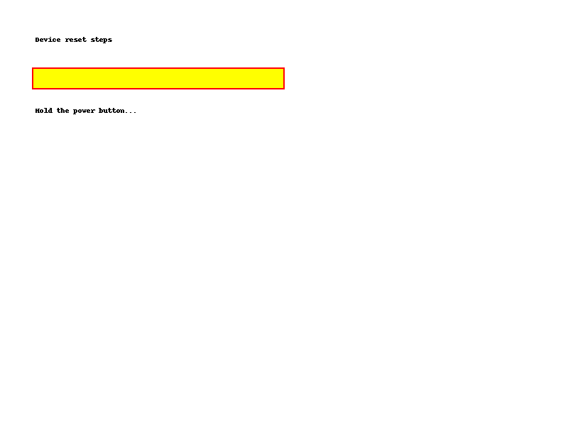

# Fuzzy Text Highlighter

**Fuzzy Text Highlighter** is a Chrome extension that highlights similar text on any webpage when you click on a phrase.

- ✅ Works fully offline
- 🔍 Fuzzy match (Levenshtein-based) with customizable threshold
- 🔒 100% privacy — no data is sent anywhere

## How it works

Click any piece of text on a webpage. If it’s close to a phrase in your `data.json`, the extension highlights the best match in yellow with 70% opacity and shows the result text.

## Example Data

```json
[
  { "text": "How to reset your device", "result": "press reset button" },
  { "text": "Warranty period is 2 years", "result": "2 years warranty" }
]
```

## Screenshots



## Privacy Policy

[View the Privacy Policy](privacy.html)
